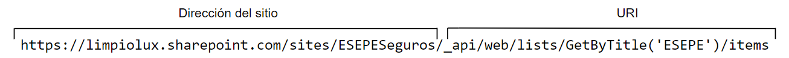
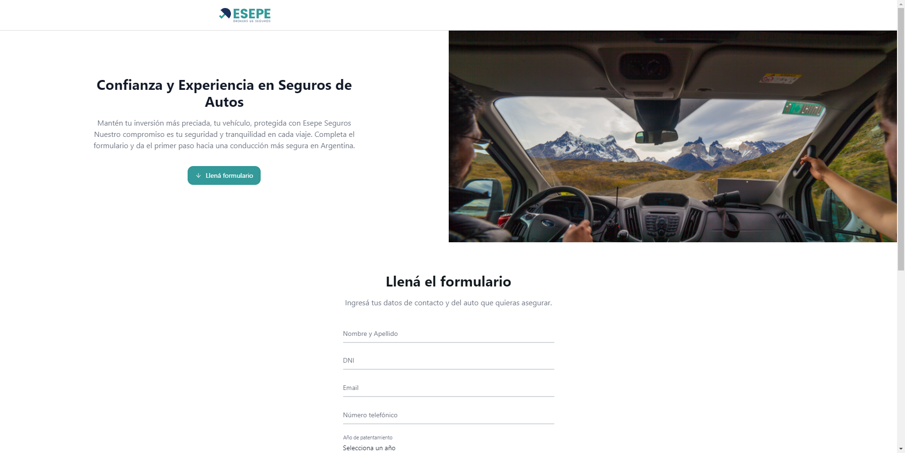
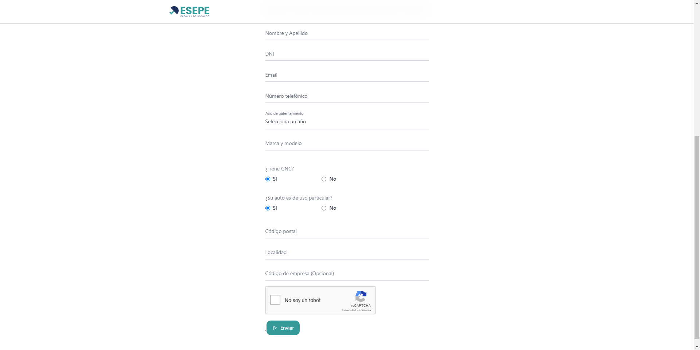

# Esepe Seguros

En el área de sistemas desarrollamos una Landing Page para [Esepe Seguros](https://seguros.esepe.com.ar/) con un formulario de contacto que se conecta a una lista de Sharepoint. 

Primero desarrollamos el Front End con React, Tailwind y NextUI. Despues hicimos el Back End con Power Automate y Sharepoint e hicimos la conexión entre el Front y Back.

## Sharepoint 

Usamos Sharepoint para guardar la información que nos envían desde el Front End para que posteriormente Esepe Seguros los contacte y le ofrezcan un plan de seguro. 

Creamos un sitio de Sharepoint y una lista, al crearlos, conseguimos un endpoint para enviar un nuestra información con un método POST:

```https://limpiolux.sharepoint.com/sites/ESEPESeguros/_api/web/lists/GetByTitle('ESEPE')/items```



Ya con esto podemos crear un desencadenador de flujo en Power Automate llamado "Cuando se recibe una solicitud HTTP" para recibir un JSON con toda la información de contacto, para despues enviarlo al endpoint de Sharepoint.

## Información solicitada

El formulario pide información obligatoria para poder enviarla a la lista de Sharepoint en formato JSON, esta información es:

1. Nombre y Apellido
2. DNI
3. Email
4. Número telefónico
5. Año de patentamiento del vehículo
6. Marca y modelo del vehículo
7. ¿Tiene GNC? 
8. ¿Su auto es de uso particular? 
9. Código postal
10. Localidad
11. Código de empresa (Opcional)

Despues de llenar todos estos campos, te va a pedir que soluciones un reCaptcha de Google. 

## Instalación
 
Para instalarlo en un ambiente de producción con Docker, lo tenes que subir al servidor y ejecutar estos dos comandos: 

```docker build -t esepe-seguro .```

```docker run -p 8002:8002 -d esepe-seguro```

Ya con esos dos comandos ya estaría andando en el Localhost en el puerto 8002.

Tambien necesitamos configurar el Power Automate y crear la lista de Sharepoint.

## Screenshots






